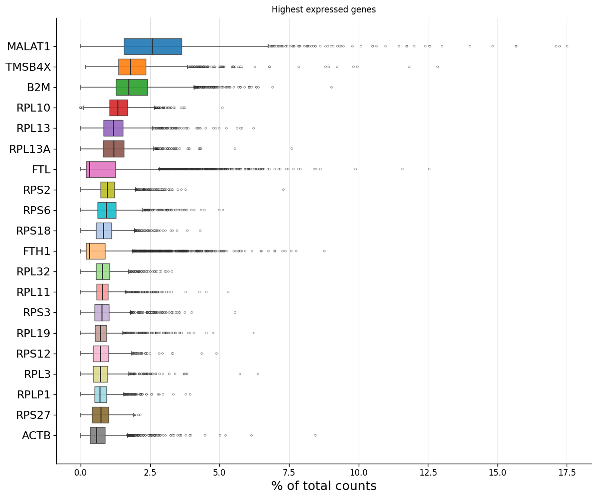
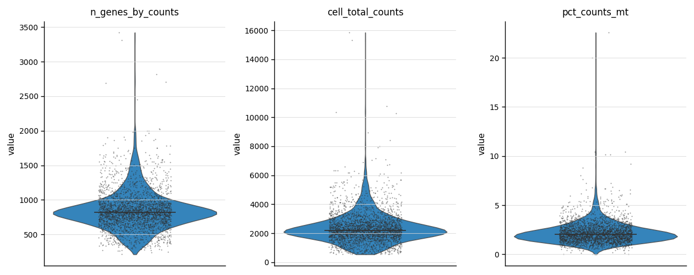
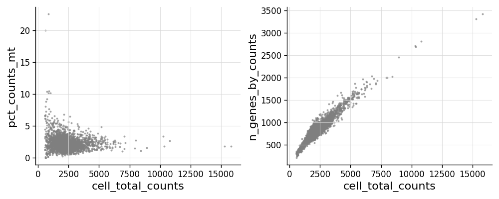
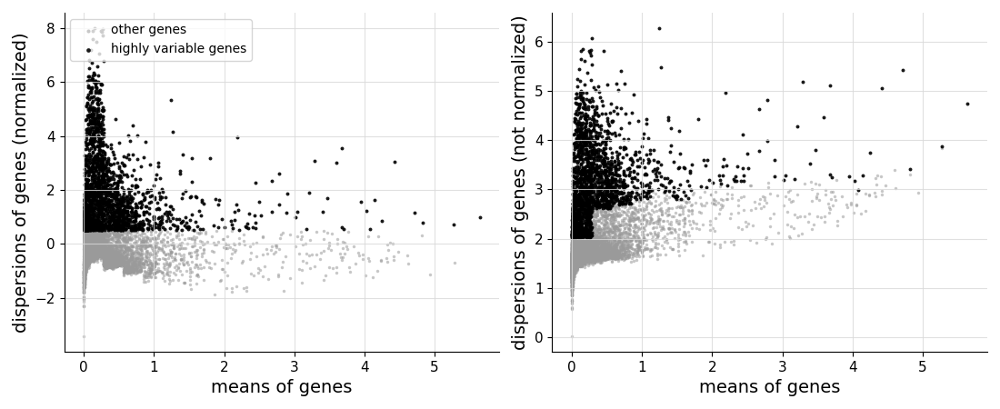
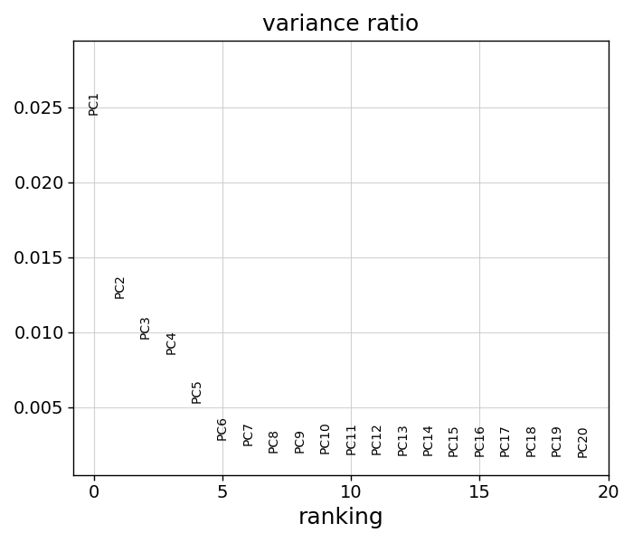
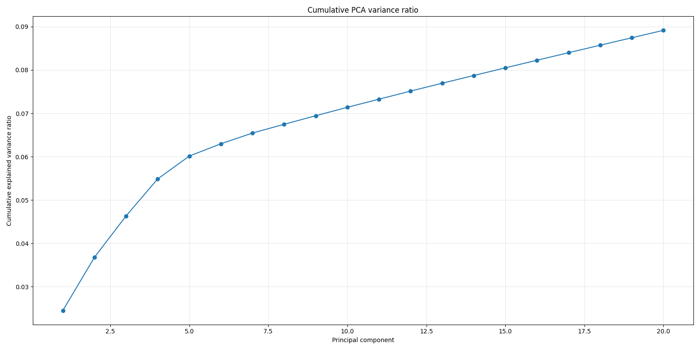
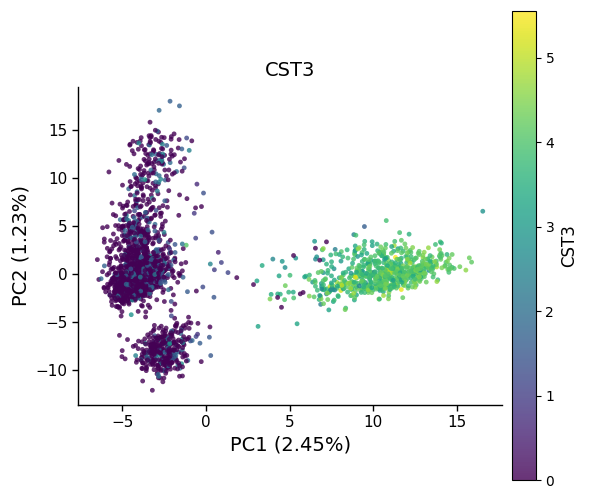
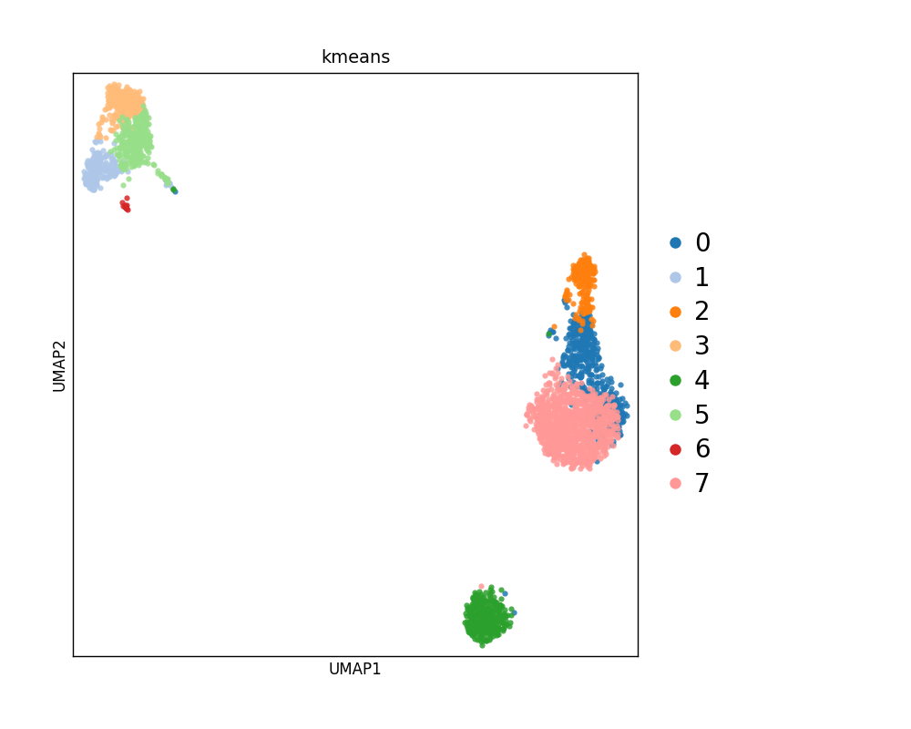
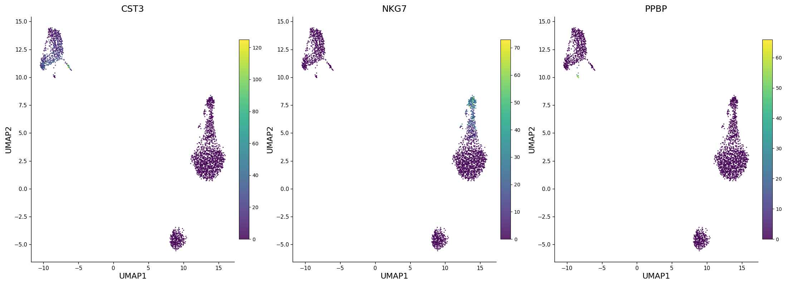

# 画图的参数说明

本页汇总 scAtlasPy 所有画图函数的通用参数、决策指南，以及 QC、HVG、PCA、UMAP 四类图的具体画法和解读。

## 开始前需要完成

以下步骤需要在画图前已完成（按照 Basic 教程流程）：

```python
# 这些步骤应该在画图前已经执行完毕，这里仅作回顾
# 1. 导入数据 → 2. QC + 过滤 → 3. 标准化 + HVG
# 4. build_read_index → 5. PCA → 6. KMeans → 7. UMAP

# 如果你还没有运行，请先参考 basic/ 教程完成前置步骤
sap.pp.calculate_qc_metrics(atlas, qc_vars={"mt": "MT-", "ribo": "^(RPS|RPL)"})
sap.pp.filter_cells(atlas, min_genes=200, min_counts=500)
sap.pp.filter_genes(atlas, min_cells=3)
sap.pp.normalize_and_log1p(atlas, target_sum=1e4)
sap.pp.highly_variable_genes(atlas, n_top_genes=2000)
atlas.build_read_index(
    cell_condition="filter_cells",
    gene_condition="filter_genes",
    use_hvg=True,
    use_data="data_log1p",
)
sap.tl.pca(atlas, n_components=50)
sap.tl.kmeans(atlas, n_clusters=10)
sap.tl.umap(atlas, fit_sample_n=50000)
```

## 画图通用参数

几乎所有 `sap.pl` 函数共享以下参数，提前了解可以避免反复试错：

### `sample_n` — 大数据抽样

UMAP、PCA 散点图、QC 图都支持 `sample_n` 参数。当细胞数超过几十万时，画所有点既慢又没有信息增益：

| 数据规模 | 建议 `sample_n` | 说明 |
|---|---|---|
| < 5万细胞 | `None`（全量） | 直接画全部细胞 |
| 5万–50万 | `50000` | 抽样足够观察整体结构 |
| 50万–500万 | `100000` | 适当增大保持结构分辨率 |
| > 500万 | `200000` | 平衡速度和信息量 |

抽样在 SQL 层完成（`USING SAMPLE ... ROWS`），不会把全量数据加载到 Python 内存。

### `use_data` — 选择表达字段

| 字段 | 含义 | 适合什么图 |
|---|---|---|
| `data` | 原始 counts | 基本不用来画图 |
| `data_log1p` | 标准化 + log1p | **画基因表达图的首选**（violin、UMAP features、dotplot） |
| `data_scale` | z-score 标准化 | 适合需要跨基因可比性的场景 |

几乎所有表达图默认使用 `data_log1p`。`data_log1p` 值一般在 0–10 左右，画图时 colorbar 比较好调。

```{note}
大部分画图函数的参数名是 `use_data`。`sap.pl.rank_genes_groups_violin()` 是例外，使用 `use_expr_field`。
```

### `save_path` / `save` — 保存图片

多数画图函数支持 `save_path` 参数：

```python
sap.pl.umap(atlas, color="kmeans", save_path="umap_kmeans.png")
```

图片以 300 dpi 保存，适合直接用于报告。

`pca_variance_ratio` 和 `pca_variance_ratio_cumsum` 的参数名是 `save`：

```python
sap.pl.pca_variance_ratio(atlas, n_pcs=50, save=".pdf")
sap.pl.pca_variance_ratio_cumsum(atlas, n_pcs=50, save="my_pca_cum.png")
```

`save` 参数的灵活用法（以 `pca_variance_ratio` 为例）：

| 写法 | 保存为 |
|---|---|
| `save=True` | `pca_variance_ratio.png` |
| `save=".pdf"` | `pca_variance_ratio.pdf` |
| `save="_test.png"` | `pca_variance_ratio_test.png` |
| `save="my_figure.pdf"` | `my_figure.pdf` |

---

## 画图决策指南

| 你想了解什么 | 推荐图 | 关键看点 |
|---|---|---|
| 数据是否有严重技术偏差 | `highest_expr_genes` | 前几个基因占比是否异常高 |
| 过滤阈值是否合理 | `violin_qc_metrics` + `scatter_qc_metrics` | counts/genes 的分布形态，线粒体比例 |
| 高变基因选择是否合理 | `highly_variable_genes` | HVG 是否在 mean 中段集中 |
| PCA 是否捕获了有意义的结构 | `pca_variance_ratio` + `pca(color="kmeans")` | 方差下降曲线，cluster 在 PCA 空间是否初步分开 |
| 是否有批次效应 | `pca(color="batch")` + `umap(color="batch")` | 批次是否形成独立 cluster |
| 聚类是否合理 | `umap(color="kmeans")` + `kmeans_cluster_size` | UMAP 上 cluster 是否分开，大小是否均匀 |
| cluster 0 的 marker 是什么 | `tl.rank_genes_groups` + `pl.rank_genes_groups` | 排名靠前的基因名 |
| 某基因是否是某 cluster 的 marker | `violin` + `dotplot` + `stacked_violin` | 该 cluster 中表达量和表达比例是否明显高于其他 |
| 细胞类型注释是否正确 | `umap(color="cell_type_manual")` + `dotplot(genes=markers)` | 注释结果在 UMAP 上是否连续，marker 表达是否符合预期 |

---

## 质控图

质控图用于回答三个问题：有没有异常高表达基因主导了数据？细胞质量和测序深度是否合理？线粒体比例是否异常？

### 最高表达基因占比

```python
sap.pl.highest_expr_genes(
    atlas,
    n_top=20,
)
```

**怎么读图**：每个基因的箱线图显示它在各细胞中占总 counts 的百分比。如果前 1–2 个基因占比显著高于其他基因（比如占了 30% 以上），说明可能存在技术偏差（如核糖体 RNA 污染）。

**参数说明**：

| 参数 | 含义 |
|---|---|
| `n_top=20` | 展示前多少个最高表达基因 |
| `use_all_cells=True` | 用全量细胞统计（包括零表达细胞），更真实反映占比 |
| `show_outliers=False` | 是否绘制离群点，大数据建议关闭 |
| `sample_cells` | 大数据可抽样（如 `sample_cells=100000`），避免全量 dense grid OOM |

<!-- TODO: Restore when the static example image is available.

-->

### QC 指标小提琴图

```python
sap.pl.violin_qc_metrics(
    atlas,
    keys=["n_genes_by_counts", "cell_total_counts", "pct_counts_mt"],
    sample_n=50000,
    use_filtered=False,
)
```

**怎么读图**：

- `n_genes_by_counts`：每个细胞检测到的基因数。典型 PBMC 数据中位数约 500–1500。中位数过低（<200）说明数据质量可能有问题。
- `cell_total_counts`：每个细胞的总 UMI 数。分布应该有明显的峰值，没有异常的极端高值尾巴。
- `pct_counts_mt`：线粒体基因占比。人类 PBMC 通常 <5–10%。如果大量细胞线粒体比例 >20%，可能是有大量死细胞或受损细胞。

**参数说明**：

| 参数 | 含义 |
|---|---|
| `keys` | 要展示的 obs 列名列表 |
| `sample_n=50000` | 抽样细胞数，小提琴图不需要全量 |
| `use_filtered=True` | 设为 True 只画通过 `filter_cells` 的细胞 |
| `multi_panel=True` | True 为并排面板，False 为上下堆叠 |

<!-- TODO: Restore when the static example image is available.

-->

### QC 指标散点图

```python
sap.pl.scatter_qc_metrics(
    atlas,
    sample_n=50000,
)
```

**怎么读图**：

- `cell_total_counts` vs `pct_counts_mt`：沿 x 轴向右，如果线粒体比例随 counts 降低而升高，说明低测序深度细胞倾向于受损。这是正常现象，但要确认过滤阈值设定合理。
- `cell_total_counts` vs `n_genes_by_counts`：应该是正相关。如果有细胞 counts 高但基因数很低，可能是技术噪音。

默认展示两对关系。可以通过 `pairs` 参数自定义：

```python
sap.pl.scatter_qc_metrics(
    atlas,
    pairs=[
        ("cell_total_counts", "pct_counts_mt"),
        ("cell_total_counts", "n_genes_by_counts"),
        ("n_genes_by_counts", "pct_counts_mt"),
    ],
    sample_n=50000,
)
```

<!-- TODO: Restore when the static example image is available.

-->

---

## 高变基因图

`sap.pl.highly_variable_genes()` 是 HVG 绘图的统一入口，通过 `flavor` 参数切换绘图风格：

```python
# Seurat v3 风格（默认）
sap.pl.highly_variable_genes(atlas, flavor="seurat")

# 标准方差/变异系数风格
sap.pl.highly_variable_genes(atlas, flavor="cv")

# 方差风格
sap.pl.highly_variable_genes(atlas, flavor="var")
```

**`flavor` 参数**：

| `flavor` | 说明 |
|---|---|
| `"seurat"`（默认） | Seurat v3 风格，展示标准化方差 vs 均值 |
| `"cv"` | 变异系数风格，展示 normalized variance vs mean |
| `"var"` | 方差风格，与 `"cv"` 调用同一底层实现 |

**怎么读图**：

- 高变基因（高亮显示）应该在中等表达量区域集中出现。如果高变基因集中在极高表达量区域，说明可能在原始 counts 空间选择了高变基因，应该先做标准化。
- **判断标准**：高变基因应该在 mean 的中段分散开，而不是全部挤在最右侧。如果你调整了 `n_top_genes`，可以观察图来确认选择的高变基因是否合理。

```{note}
`sap.pp.highly_variable_genes()` 是计算高变基因的预处理函数，结果写入 `var.highly_variable_genes`。
`sap.pl.highly_variable_genes()` 是画图函数，从 `var` 表中读取已有结果进行绘制。
```

<!-- TODO: Restore when the static example image is available.

-->

---

## PCA 图

需要已完成 PCA 降维步骤（参考 {doc}`../basic/basic_exploration`）。

### 方差解释率

```python
# 各主成分的方差解释率
sap.pl.pca_variance_ratio(atlas, n_pcs=50)

# 累计方差解释率
sap.pl.pca_variance_ratio_cumsum(atlas, n_pcs=50)
```

**怎么读图**：

- **方差解释率图**：第一个 PC 通常解释最多变异。观察曲线是否快速下降——如果前十来个 PC 解释了大量变异，后续趋于平缓，这是正常形态。
- **累计图**：在单细胞数据中，前 50 个 PC 累计解释 15–30% 的变异属于正常范围。如果前几个 PC 的解释率极低（<1%），可能需要检查数据过滤是否合理。
- **批次效应判断**：如果 PC1 解释了异常高的变异（>50%），很可能不是生物信号而是批次效应。

**保存**（注意：这两个函数使用 `save` 参数，不是 `save_path`）：

```python
sap.pl.pca_variance_ratio(atlas, n_pcs=50, save=".pdf")
sap.pl.pca_variance_ratio_cumsum(atlas, n_pcs=50, save="my_pca_cum.png")
```

<!-- TODO: Restore when the static example image is available.

-->

<!-- TODO: Restore when the static example image is available.

-->

### PCA 散点图

```python
# 按聚类结果上色
sap.pl.pca(atlas, color="kmeans", sample_n=100000)

# 按某个基因表达上色
sap.pl.pca(atlas, color="CST3", use_data="data_log1p")

# 指定不同的主成分维度
sap.pl.pca(atlas, color="kmeans", x_pc=1, y_pc=2)

# 返回数据用于自定义分析
plot_df = sap.pl.pca(atlas, color="kmeans", return_df=True)
```

**怎么读图**：

- 按 `kmeans` 上色：观察不同 cluster 在 PCA 空间是否初步分开。如果所有 cluster 在 PC1/PC2 上完全混合，后续 UMAP 也不会有好的分离。
- 按基因表达上色：确认关注的基因是否驱动了主要变异方向。如果某个 marker gene 的表达和 PC1 高度一致，说明它是数据中的主要变异来源。

**`legend_loc` 选项**：

| 值 | 效果 |
|---|---|
| `"right_margin"` | 图例在右侧（默认），适合类别数适中 |
| `"on_data"` | 标签直接标在各类别的中位数位置，适合类别较多 |
| `None` | 不显示图例 |

<!-- TODO: Restore when the static example image is available.

-->

---

## UMAP 图

UMAP 是 scAtlasPy 最核心的可视化工具。同一个函数可以根据 `color` 参数自动切换绘制模式。

需要已完成 UMAP 降维步骤（参考 {doc}`../basic/basic_exploration`）。

### 按 obs 列上色

```python
# 按 cluster
sap.pl.umap(atlas, color="kmeans", sample_n=100000, legend_loc="right_margin")

# 按样本/批次
sap.pl.umap(atlas, color="sample_id", sample_n=100000)

# 按细胞类型注释
sap.pl.umap(atlas, color="cell_type_manual", sample_n=100000)

# 加 where 条件筛选特定细胞
sap.pl.umap(atlas, color="kmeans", sample_n=50000, where="kmeans IN (0, 1, 2)")
```

**怎么读图**：

- cluster 是否在 UMAP 空间分开？如果分开好，说明聚类和降维结果一致。
- 不同样本/批次是否混合？如果某个样本形成孤立的岛，可能有批次效应。
- 用 `where` 条件放大查看特定 cluster 的内部结构。

**图例位置**：

```python
# 右侧图例
sap.pl.umap(atlas, color="kmeans", legend_loc="right_margin")

# 标签直接标在图内各 cluster 中心
sap.pl.umap(atlas, color="kmeans", legend_loc="on_data")
```

<!-- TODO: Restore when the static example image is available.

-->

### 按基因表达上色

```python
# 单个基因
sap.pl.umap(
    atlas,
    color="CST3",
    use_data="data_log1p",
    sample_n=100000,
)

# 多个基因并排
sap.pl.umap(
    atlas,
    color=["CST3", "NKG7", "PPBP", "MS4A1"],
    use_data="data_log1p",
    sample_n=100000,
    ncols=2,
)
```

**怎么读图**：

- 基因表达是否局限在特定的 UMAP 区域？一个好的 marker gene 应该在某个 cluster 区域明显高表达，其余区域低表达。
- 多个基因时放在一起对比，确认每个基因的高表达区域是否对应预期的细胞类型。

**`ncols` 参数**：控制每行放几个子图。基因较多时建议 `ncols=3` 或 `ncols=4`。

<!-- TODO: Restore when the static example image is available.

-->

### 混合模式

```python
# kmeans + 两个基因，自动判断类型分别画图
sap.pl.umap(
    atlas,
    color=["kmeans", "CST3", "NKG7"],
    use_data="data_log1p",
)
```

color 列表中的元素会自动判断是 obs 列还是基因名，然后分别调用对应的绘图逻辑。

### 全量流式绘图（避免 OOM）

```python
# sample_n=None 时走全量 streaming 绘图，分批次画点，适合展示完整 UMAP 给报告用
sap.pl.umap(
    atlas,
    color="cell_type_manual",
    sample_n=None,
    plot_batch_size=200000,
)
```

`plot_batch_size` 控制每批读取和绘制多少个细胞。内存不足时可以调小。

### UMAP 上色参数速查

| 你想看什么 | 改哪里 | 示例 |
|---|---|---|
| 按 cluster 上色 | `color="kmeans"` | `color="kmeans"` |
| 按样本/批次 | obs 列名 | `color="sample_id"` |
| 看一个基因 | 基因名 | `color="MS4A1"` |
| 看多个基因并排 | `color=[...]` + `ncols` | `color=["IL7R", "LYZ", "NKG7"], ncols=3` |
| 只看特定 cluster | `where` | `where="kmeans IN (0, 1, 2)"` |
| 数据太大画图慢 | `sample_n` | `sample_n=30000` |
| 保存图片 | `save_path` | `save_path="umap.png"` |
| 标签标在图内 | `legend_loc` | `legend_loc="on_data"` |

---

## 附：PBMC 常用 marker gene

| 细胞类型 | Marker Genes |
|---|---|
| CD4 T cells | IL7R |
| CD14+ Monocytes | CD14, LYZ |
| B cells | MS4A1, CD79A |
| CD8 T cells | CD8A |
| NK cells | GNLY, NKG7 |
| FCGR3A+ Monocytes | FCGR3A, MS4A7 |
| Dendritic Cells | FCER1A, CST3 |
| Megakaryocytes | PPBP |

如果你分析的是肿瘤、发育或其他组织，请换成对应领域的 marker gene。
